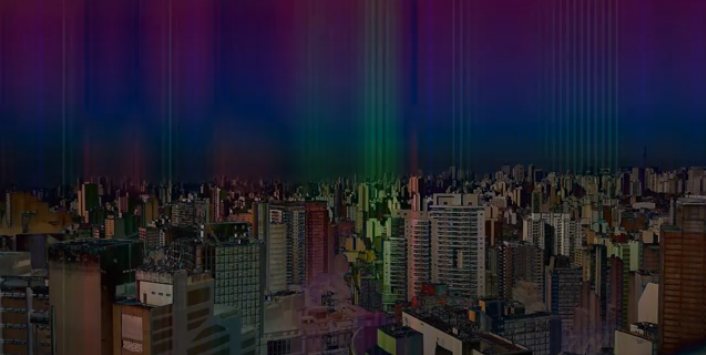

---

**Hamsá Trio** é formado por Sandra Rocha, André Papi e Alexandre Villares 

---

### Trabalhos recentes

##### Num apartamento perdido na cidade: Anoitecer

****

> vídeo com áudio descrição: [**https://www.youtube.com/watch?v=64xD1vUbt_I**](https://www.youtube.com/watch?v=64xD1vUbt_I) | vídeo sem áudio descrição: [**https://www.youtube.com/watch?v=Vm1oJbNQ-nM**](https://www.youtube.com/watch?v=Vm1oJbNQ-nM)

##### Num apartamento perdido na cidade: Negative

> Enviado ao 2º Salão de arte em pequenos formatos do museu de arte de britânia 2020 | vídeo em [**https://www.youtube.com/watch?v=-6mbx9ZIs8o**](https://www.youtube.com/watch?v=-6mbx9ZIs8o&feature=youtu.be)

##### Num apartamento perdido na cidade: Colors

> [https://youtu.be/pz2nTNICrkc](https://youtu.be/pz2nTNICrkc)

### Sobre Hamsá Trio

O Grupo Hamsá Trio foi reunido por Sandra Rocha, cujo contato inicial com André Papi foi em trabalhos conjuntos na SP Escola de Teatro, tendo se juntado ao grupo Alexandre Villares em virtude do desejo de realizar experimentações audiovisuais com arte mídia (*new media art*, programação criativa).

**André Papi** é Performer Sonoro, Compositor de trilhas para Teatro, Dança, Performance e suas variações. Também é Compositor e Produtor Musical. Formado em Produção Musical pela Anhembi Morumbi em 2012 via ProUni e na SP Escola de Teatro em Sonoplastia, tendo uma breve passagem pelo curso de História na USP nos efervescentes anos de 2013 a 2014. É membro fundador do coletivo de teatro preto Não É Safari.

**Sandra Rocha** é arquiteta formada pela FAU Mackenzie (2002), em Organização em Eventos pelo Senac (2012) e formanda na SP Escola de Teatro no Curso Técnico de Iluminação no âmbito das Artes Cênicas e Artes Visuais (2020), tendo realizado projetos nas áreas de Arquitetura, Design de interiores, Cenografia teatral, Organização e Decoração de eventos sociais. Sócia Fundadora da Empresa Sotie Eventos.

**Alexandre Villares** é professor, artista visual e consultor em novas mídias. Pesquisa práticas artísticas que se valem de meios computacionais e o ensino de programação em um contexto visual. Arquiteto pela FAU-USP (2000) e mestre pela FEC-Unicamp (2019).Membro da Processing Foundation e co-organizador da Noite de Processing em São Paulo. Ministra cursos e oficinas em diversas instituições, desenvolve atividades como educador de tecnologias e artes no Sesc Av.Paulista.
